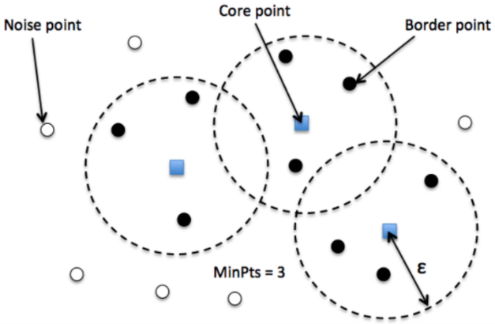

# Unsupervised Learning and Preprocessing

* no predefined class
* use:
  * exploratory setting
  * preprocessing


## Preprocessing

```
StandardScaler
# each feature's mean is 0 and variance is 1
# disadvantage: the outliers may influence it

RobustScaler
# same scale as standardscaler, but uses median and quartiles
# but it ignores outliers

MinMaxScaler
# shift the data such that all features are exactly 0 between and 1
# since the min becomes 0, and the max becomes 1
# we need to transform both the train and test sets


Normalizer
# each feature vector's length is 1
# use only the direction of the data matters

```

* why sometimes the scaled test set are not between 1 and 0:
  * transformer applies the same transform to the training and test set
    * _**x\_after\_scaled = x\_test\_value - training\_set\_minimum / training\_set\_range、**_
    * _**same transformation, so for the training set, the max = 1 / min = 0**_
* we need to apply the **same transformation** to both sets
  * don't scale them separately
* shortcut:


## Dimensionality Reduction

### Principal Component Analysis (PCA)

* rotates the dataset so that the features re statistically uncorrelated
* procedures:
  * find the line where the features are most correlated with each other
    * max variance
  * using vector multiplication to rotate it
    * cos90 = 1, which will contain the most information


* so now the two features are not correlated
* the mean was subtracted from the data between rotation


* every time find the most 'fit' line through the origin (to maximize SS(distance)) <---Eigenvalues
* it is comparable to that we use the new PCAs to predict
* overlapping data points: not that informative


* it is unsupervised but it can be used to check the dimension, something related to the algorithms that we can use


### K-Means Clustering

* cluster by using mean distances
* **decomposition - each data point is presents by its center**
* specify the number of clusters
* doesn't have the concept of noise ---> random assignment sometimes
*


### Agglomerative Clustering

* specify the number of clusters
* **can use dendrograms to represent hierarchy**
* more uneven than k-means but less uneven than dbscan
* no notion of center

### DBSCAN




* density- based spatial clustering of applications with noise
* **complex shapes**
* eps
  * **increase eps ---> decrease noise** &#x20;
  * very large: only one cluster
  * very small: all are noise
* min\_samples
  * increase ---> some points become noise, it decides the **minimal cluster size**
  * **decrease ---> decrease noise**
* eps default: 0.5
  * setting eps to control the number of&#x20;
* we need to scale them first
* returns -1: noise
* **can automatically determine the number of clusters**
* **very differently sizes**


## Comparing and Evaluating Clustering Algorithms

### ARI (Adjusted Random Index) / NMI (Normalized Mutual Information)


* &#x20;with ground truth (we have labelled data)
* ARI can be negative, nit NMI: \[0,1]
* a random assignment of cluster ---> 0
* optimum ---> 1
* why not used accuracy\_score:
  * we don't know whether **the assigned cluster label 100% matches the ground truth**&#x20;


### Silhouette Coefficient

* unlabelled data
* computes the compactness of a cluster
  * perfect: 1
* **not allowed for complex shapes** and not work well in reality


### Robustness-Based Clustering Matrix&#x20;

* add some noise or use different settings of parameters
* many parameters same results ---> truthworthy

**we don't know semantic meaning still ---> manual search**

****

### **Outlier Detection**

* finding the odd one out

## Summary

* all the clusterings can be applied on large datasets
* mainly for **exploratory use**


****


